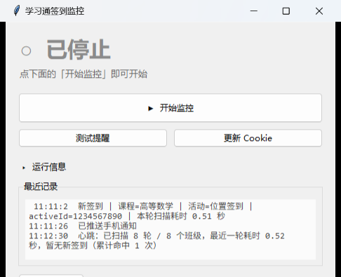

**English** | [简体中文](README.zh-CN.md)

# cxmon — XueXiTong / Chaoxing sign-in monitor

> So you actually notice the sign-in, while it still counts.

If your classes use XueXiTong (学习通 / Chaoxing), you know the moment: the teacher says
"sign in now", and you're heads-down taking notes, queueing at the canteen, just drifting off,
or your phone is on silent at the bottom of your bag. By the time someone posts "don't forget
to sign in", the window has closed — and that's an absence on your record.

A XueXiTong sign-in window is usually only **1–3 minutes long**, and it doesn't shout: it just
appears quietly in the course activity list and waits for you to look. This tool does the
looking. Within seconds of a teacher starting a sign-in, your PC **says it out loud**
("Attention, Calculus started a location sign-in"), a toast pops up, and if you configured
phone push, WeChat buzzes too.

**You still tap the sign-in button yourself** (on your phone or tablet) — it just won't slip
past you anymore.

The reason this exists is simple: **I missed sign-ins myself, more than once.**

### What it deliberately does *not* do (more important than what it does)

- ❌ **It never signs in for you.** Auto-signing violates the platform's terms of use and can get
  your attendance flagged, so this tool stays out of it.
- ❌ It doesn't forge or modify anything, and doesn't touch your grades, homework or messages.
- ❌ **It doesn't upload anything.** Your login credential lives only in `config.json` on your own
  machine (listed in `.gitignore`, so it can never be committed).

### Who it's for

- Anyone whose classes use XueXiTong sign-ins (online or in person)
- Any sign-in type the teacher picks (normal / location / QR / gesture)
- Especially **people who are often away from their PC** — that's when phone push earns its keep

**Platform**: Windows + Python 3.8+. **Zero third-party dependencies** (standard library only —
there is nothing to `pip install`).

> The repository is named `xuexitong-qiandao`; the internal Python package is `cxmon`
> (shorter to type). The launcher script is `启动监控.bat` (Chinese for "start monitoring").

---

## 0. Quick start (about 5 minutes)

```bat
:: 1) Check your environment and hear a sample of the voice
python cxmon.py doctor --speak

:: 2) Import your sign-in credentials (three ways, see section 3)
python cxmon.py browser-cookie

:: 3) Start monitoring
python cxmon.py panel          :: or just double-click 启动监控.bat

:: Want to see it work without touching your account?
python cxmon.py monitor --mock
```

Before class, double-click `启动监控.bat` and press **Start monitoring**; after class,
press **Stop monitoring**. See section 2 for the UI.

### About WeChat / phone push (important)

**Phone push has to be configured by each user — this repo contains nobody's keys.**

- Works with no setup: **speech + beep + Windows toast on your PC**.
- To get it on your phone, create your own push channel (e.g. a
  [Server酱](https://sct.ftqq.com/) SendKey, or a DingTalk / WeCom group bot) and put the
  URL into `alert.webhook` in `config.json`. Steps are in section 6.

The reason is simple: a push channel is bound to *your own* WeChat account, so every user
brings their own.

### What is in this folder

| File | Purpose | Do you need to touch it? |
| --- | --- | --- |
| `启动监控.bat` | Double-click to open the control panel | Just double-click it |
| `config.json` | Your settings (**contains your Cookie — never share it**) | Usually no; the panel edits it |
| `state.json` | Already-alerted sign-ins (used for de-duplication) | No |
| `monitor.log` | Run log: every scan, hit and error | Paste it when reporting a problem |
| `monitor.pid` / `tray.pid` | PIDs of the running monitor / tray process | No |
| `app-icon.ico` | Desktop / tray icon (green check, 7 sizes 16–256 px) | No |
| `README.md` / `README.zh-CN.md` | This document / 中文说明 | When you forget something |
| `cxmon/` | The program itself | No |

> `config.json`, `state.json` and `monitor.log` are listed in `.gitignore`, so they are
> **never committed**. Your Cookie stays on your own machine.

### Where the files are

The folder you cloned or unzipped, e.g. `C:\Users\<you>\Documents\cxmon`.
You can open it from the control panel with the **Open project folder** button.

---

## 1. How it works

XueXiTong's "activities happening right now" come from a mobile web API:

| Purpose | Endpoint |
| --- | --- |
| Which courses/classes you have | `GET https://mooc1-api.chaoxing.com/mycourse/backclazzdata?view=json&rss=1` |
| Activities running in a class | `GET https://mobilelearn.chaoxing.com/v2/apis/active/student/activelist?fid=..&courseId=..&classId=..` |

The tool polls those endpoints every few seconds with your own Cookie and raises an alert
when it sees an **ongoing sign-in it has not seen before**.

### Field quirks that matter (measured on 148 real records, 2026-09)

These were discovered the hard way; they decide whether the tool is accurate:

| Finding | Why it matters |
| --- | --- |
| **Sign-ins have `type == 2`** | Normal / location / QR / gesture sign-ins are all `type=2`; in-class quizzes are `42`, "pick a student" is `11`, notices are `45` |
| **The readable name is in `nameOne`, not `name`** | In real records `name` is empty and `nameOne` holds "位置签到" (location sign-in) |
| **`otherId` is NOT the activity id** | `otherId` is the sign-in *sub-type* (e.g. `4` = location). The real activity id is `id` (a 13-digit number). An early version used `otherId`, so **every location sign-in shared one key — it alerted once and then stayed silent forever** |
| **The API also returns history** | Those 148 records included sign-ins from months earlier, all `status=2` (finished). Without a time filter, the first run would have alerted on months of old sign-ins |

So the actual rule is: **(type == 2, or the name contains 签到/签退) AND (already started) AND (not yet ended)**.

---

## 2. Daily use (double-click, no command line)

Double-clicking `启动监控.bat` opens the control panel (demo data in the screenshot, not a real account):



**Before class**: double-click → press **Start monitoring** → close the window (choose "keep monitoring").
**After class**: double-click → press **Stop monitoring**.

Design details:

- **Closing the window asks what you want**: stop and quit completely / keep monitoring in the
  background / cancel. It never silently stops monitoring and makes you miss a sign-in.
- **Single primary button**: its label always matches reality (`Start monitoring` ⇄ `Stop monitoring`),
  so the UI can never show contradictory state.
- **Runtime info is collapsed by default** behind a small `▸ Runtime info` button; expanding it
  grows the window instead of squeezing the log.
- **Tray icon** (bottom-right): **single-click** opens the panel; hovering shows the current state;
  right-click gives Open panel / Start or stop monitoring / Quit. If the tray ever disappears
  (it can be killed), the monitor re-creates it within 30 seconds.
- **Only one panel, ever**: a Windows named mutex guarantees a second launch just brings the
  existing window to the front.
- **The panel and the monitor are separate processes**: if the panel crashes or is closed,
  monitoring continues.

---

## 3. Getting your Cookie

The Cookie is your login credential; the tool uses it to read the API. It usually stays valid
for weeks. **Never share it and never commit it.**

### Method 1: from the XueXiTong PC client (easiest — recommended)

The official Windows client (`cxstudy.exe`) is an Electron app that keeps its own Cookie
database at `%APPDATA%\cxstudy\Network\Cookies`, and **it does not use App-Bound encryption**,
so it can be read:

```bat
python cxmon.py browser-cookie
```

It reads the Cookie, **verifies it against the live API**, and writes it into `config.json`
if it works. Nothing sensitive is printed.

> The client must have been logged in, and it must be **closed** (Windows locks the database
> while it runs). Or use `--wait-close` and close it afterwards.

### Method 2: from a browser (Chrome / Edge)

```bat
python cxmon.py browser-cookie --browser edge
```

⚠️ **This usually fails on Chrome/Edge 127+**: they use **App-Bound Encryption** (ciphertext
prefix `v20`), whose key is bound to the browser binary — closing the browser or copying the
database does not help. The tool detects this and says so instead of pretending it found nothing.

### Method 3: copy it manually from DevTools (always works)

1. Open the tab where you are logged in to XueXiTong
2. Press `F12`, go to the **Network** tab, press `F5`
3. Click the first request in the list
4. Open **Headers** → scroll to **Request Headers**
5. Find the line starting with `cookie:` — triple-click it, `Ctrl+C`
6. Run `python cxmon.py cookie` and paste

Shortcut: right-click the request → Copy → **Copy as cURL**, then paste the whole thing —
the tool understands plain cookie strings, header blocks and cURL commands.

### When the login expires, you mostly don't have to do anything

1. **Automatic repair**: on detecting an expired login, the monitor re-reads the login from the
   XueXiTong PC client, verifies it against the API, writes it back and keeps going.
   (Verified: a deliberately corrupted 34-character Cookie was replaced by a valid
   1824-character one automatically and the scan continued — zero user action.)
2. **If repair fails** (e.g. the client isn't logged in either), it tells you in plain language
   via **speech + toast + WeChat**:

   > Login expired. Open the XueXiTong PC client and log in once; the tool will pick up the new
   > login within a few minutes and continue.

   The monitor **does not exit** — it retries every 5 minutes, so logging in fixes it by itself.
3. **Manually**: the `Update Cookie` button in the panel, or `python cxmon.py browser-cookie`,
   or method 3 above.

---

## 4. Commands

| Command | What it does |
| --- | --- |
| `python cxmon.py panel` | **Open the graphical control panel** (what the .bat does) |
| `python cxmon.py tray` | Start only the tray icon |
| `python cxmon.py monitor` | Start monitoring in the console (`Ctrl+C` to stop; refuses to run twice) |
| `python cxmon.py monitor --once` | Scan once and exit |
| `python cxmon.py monitor --dry-run` | Print hits but make no sound / toast / push |
| `python cxmon.py monitor --mock` | Offline demo, no Cookie and no network needed |
| `python cxmon.py monitor --interval 15` | Override the scan interval (seconds) |
| `python cxmon.py browser-cookie` | Auto-read the Cookie from the PC client / browser |
| `python cxmon.py cookie` | Paste a Cookie manually (string, header block or cURL) |
| `python cxmon.py courses` | List every class with its `courseId` / `classId` |
| `python cxmon.py probe [--all] [--raw]` | Dump the raw activity API response — use this when the platform changes fields |
| `python cxmon.py test-alert` | Exercise the alert path (voice / beep / toast / push) |
| `python cxmon.py doctor [--speak]` | Self-check the environment and play a sample sentence |

---

## 5. Configuration (`config.json`)

See [`config.example.json`](config.example.json) for the full template. The settings you are
most likely to change:

| Key | Default | Meaning |
| --- | --- | --- |
| `poll_interval` | `10.0` | Seconds between scans. Sign-ins last 1–3 minutes, so 10s is plenty; don't go below 5 |
| `jitter` | `3.0` | Random extra delay per round, so requests don't look mechanical |
| `scan_workers` | `6` | Concurrent scan threads (serial 26-class scans took ~3s; concurrent is ~0.5s) |
| `targets` | `[]` | Empty = all courses; or e.g. `[{"courseId":"...","classId":"...","name":"Math"}]` |
| `match.types` | `[2]` | Activity types to alert on (sign-in = 2) |
| `match.name_keywords` | `["签到","签退"]` | Name keywords, OR-ed with `types` |
| `alert.voice_text` | see template | Spoken text; placeholders `{course}` `{name}` `{activeId}` `{time}` |
| `alert.repeat` / `repeat_interval` | `3` / `5.0` | How many times to speak, and the gap |
| `alert.realert_after` | `0` | `>0`: re-alert every N seconds while the sign-in is still open |
| `alert.beep` / `toast` | `true` | Beep and Windows toast |
| `alert.open_url` | `false` | Open the sign-in page in your browser (off by default: you sign on your phone) |
| `alert.webhook` | empty | Phone push URL (see section 6) |

If both `types` and `name_keywords` are empty, it falls back to "alert if the name contains 签".
If you suspect the platform changed its fields, run `python cxmon.py probe --all --raw`.

---

## 6. Phone push

A sign-in window is often only 1–3 minutes, so if you are away from your PC, speech is useless.
Pick one:

- **WeChat via Server酱 Turbo**: get a SendKey at <https://sct.ftqq.com/>, then set
  `alert.webhook` to `https://sctapi.ftqq.com/<SendKey>.send`.
  (Note: Server酱³ at `sc3.ft07.com` pushes to its *own* client app, not WeChat — it is not
  suitable for a 1-minute window.)
- **DingTalk bot**: group settings → Smart group assistant → Add robot → Custom → copy the Webhook URL.
- **WeCom (企业微信) group bot**: group settings → Group robots → Add → copy the Webhook URL.

Then verify with `python cxmon.py test-alert`. A wrong key is reported explicitly
(e.g. DingTalk's `token is not exist`), never silently "successful".

---

## 7. What has actually been verified

| Item | Result |
| --- | --- |
| Cookie extraction from the PC client | ✅ 19 fields, including `_uid` / `fid` / `vc3` / `_d` |
| AES-256-GCM decryption (pure ctypes → Windows CNG) | ✅ Validated against **NIST test vectors** (AES-128 and AES-256) |
| Cookie validity | ✅ Fetched a real account's 26 classes |
| Activity API | ✅ 148 real records parsed |
| History filtering | ✅ Zero false positives from those 148 historical records |
| Sign-in matching rules | ✅ 9 decision cases pass (including "empty `name`", "quiz must not alert", "not started yet must not alert") |
| `otherId` misuse regression test | ✅ Two location sign-ins get distinct ids |
| Voice | ✅ Both paths tested (resident TTS worker and one-shot fallback), voice `Microsoft Huihui Desktop (zh-CN)` |
| WeChat push | ✅ Real push (server returned `code=0 / SUCCESS`); detection → push took **1 second** |
| Push error reporting | ✅ Bad keys are reported (DingTalk / WeCom / Server酱), never faked as success |
| De-duplication and state | ✅ The same sign-in is never alerted twice, even across restarts |
| Failure paths | ✅ Expired Cookie / unconfigured / App-Bound encryption / locked database all give clear messages |
| **Real sign-in** | ✅ A real location sign-in (4-minute window): detected **15 seconds** after it was created → speech + toast immediately → WeChat push delivered. User confirmed both arrived "within the first minute" |

Bugs found and fixed along the way (all now covered by checks):

1. An attribute shadowed a method (`self._speaker`) → the alert raised an exception and **no
   alert was ever delivered**.
2. `otherId` was used as the activity id → all location sign-ins shared one key and the tool
   **went silently dead** after the first one.
3. Matching on `name` and not filtering history → both **missed** sign-ins (`name` is empty)
   and **false-alarmed** on months-old ones.
4. Four separate missing imports (`time`, `os`, `sys`, `time`) — static checking (`pyflakes`)
   is now part of the workflow.

---

## 8. FAQ

Most questions are answered below. If yours isn't, open an issue and paste your `monitor.log`.

**How often does it check?** Every 8–10 seconds by default; a round takes ~0.5s. Detection
latency is therefore about 10 seconds worst case. Measurements show the platform itself needs
a few seconds to publish a new sign-in, so polling faster would not help.

**Can it miss one?** Yes — if you are offline, the PC sleeps, the program isn't running, or the
window is extremely short. Configure `alert.webhook` as a second channel and disable sleep.

**No sound?** Run `python cxmon.py doctor --speak`. Check the volume, the default output device,
and the permission Windows gives PowerShell. `alert.voice_name` can pick another voice
(`doctor` lists them).

**The course name is too long for speech?** Edit `alert.voice_text`, e.g.
`"Notice, new sign-in, please open XueXiTong"`.

**Will the platform notice?** The tool only issues read-only requests, roughly 3 per second at
the default interval — comparable to a normal app refresh. Any third-party tool carries some
risk of being flagged as an abnormal client; keep the interval at the default.

**Two monitors at once?** The second one refuses to start (otherwise one sign-in would be
announced twice).

---

## 9. Start automatically at logon (optional)

1. `Win+R` → `taskschd.msc` → Create Task
2. Triggers: At log on
3. Actions → Program: `python`; Arguments: `cxmon.py monitor`; Start in: this folder

Or simpler: `Win+R` → `shell:startup` and drop a shortcut to `启动监控.bat` there.

---

## 10. Layout

```
cxmon/
├─ cxmon.py                 entry point
├─ 启动监控.bat              double-click = open the control panel
├─ config.json              your settings (contains your Cookie — never share)
├─ config.example.json      template
├─ state.json               alerted sign-ins (de-duplication)
├─ monitor.log              run log
├─ app-icon.ico             desktop / tray icon
└─ cxmon/
   ├─ config.py             config loading / merging
   ├─ chaoxing.py           API client, activity parsing, offline mock
   ├─ browser_cookie.py     Cookie extraction (DPAPI + AES-GCM via pure ctypes)
   ├─ notifier.py           speech / beep / toast / webhook / open URL
   ├─ monitor.py            main loop, ongoing filter, de-duplication, alert scheduling
   ├─ panel.py              Tk control panel
   ├─ tray.py               tray icon (pure ctypes Shell_NotifyIcon)
   ├─ runtime.py            PID files, liveness, single-instance mutex
   ├─ cli.py                command line
   ├─ voice_worker.ps1      resident TTS worker
   └─ toast.ps1             balloon notification
```

---

## 11. Maintenance notes (lessons paid for in blood)

Read this before changing anything:

1. **`.bat` and `.ps1` files must stay ASCII-only.**
   `cmd.exe` reads `.bat` using the system ANSI codepage, and Windows PowerShell 5.1 does the
   same for `.ps1`. UTF-8 Chinese gets mis-parsed: at best mojibake, at worst a quote byte is
   swallowed as a GBK trail byte and the script fails with a syntax error.
   Observed consequences: `errorlevel` became `orlevel` (double-clicking the launcher did
   nothing at all), and a Chinese string literal in `toast.ps1` broke the balloon channel
   (exit code 1) for as long as it existed. Pass Chinese in from Python as arguments instead.

2. **After every change, run the static check** — "it compiles" is not enough:
   ```bat
   python -m pip install pyflakes      :: development only; the tool itself stays dependency-free
   python -m pyflakes cxmon cxmon.py   :: must report 0 issues
   ```
   `NameError` (a missing import) is invisible at compile time; four of them were hit in one day,
   one of which would have made tray self-healing crash the moment it was needed.

3. **Don't build hidden-window designs.** An earlier version hid the window on close and had the
   tray restore it; the hidden window fought with the modal dialog, and the log showed the window
   being re-hidden four seconds after each restore. Closing the window now simply exits the panel
   process, and the tray is the persistent entry point.

4. **Don't implement single-instance by looking for a window** — it races (the second instance
   starts before the first has drawn its window, so you get two). Use a **named mutex**
   (`runtime.acquire_single_instance`): race-free, released automatically even on a crash.

5. **Assume things will break.** The tray icon does vanish, processes do get killed, Cookies do
   expire. Everything fragile needs a fallback: the tray self-heals in 30 seconds, an expired
   login is repaired automatically or explained in plain language, and a duplicate start is refused.

---

## 12. License

MIT — see [LICENSE](LICENSE).

---

## 13. Disclaimer

This tool exists to **remind you** to complete your own class sign-in. It does not sign in for you,
does not forge attendance records and does not modify any XueXiTong data. Follow your school's rules
and the platform's terms of service; you are responsible for any consequences of using this tool.
